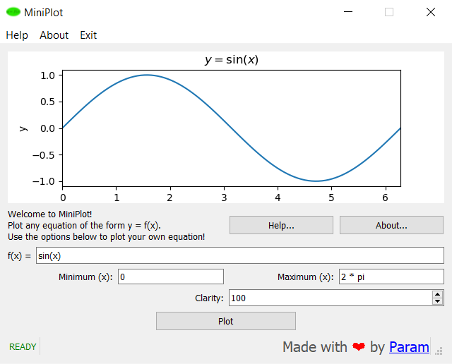

# MiniPlot

A graphical application to plot any mathematical equation of the form `y = f(x)`.

<div align='center'></div>

Made in PySide2 (Qt for Python). PyPI modules Matplotlib (along with NumPy) and
Equation were used for plotting and expression-parsing respectively.

### Execution

 - Simply execute `main.py` using Python. Use `-W ignore` to hide warning in the console e. g. Division by Zero.
   ```
   > python -W ignore main.py
   ```
 - To build distribution, use `pyinstaller`.
   ```
   > pyinstaller main.py -w -i icon.ico --clean --noconfirm
   ```
   Note: Due to dependency issues, you might need to manually copy `matplotlib` and
   `Equation` from your Python installation, and `icon.ico` from the source directory 
   to the distribution folder for the executable to function properly.